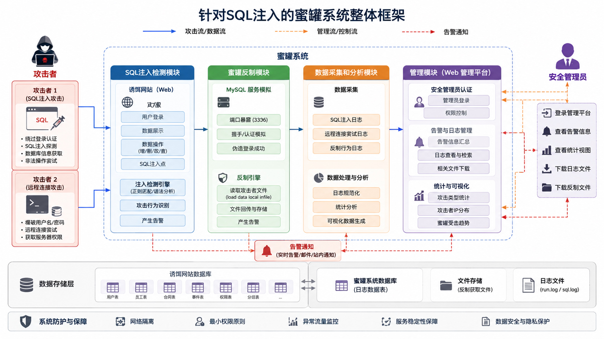
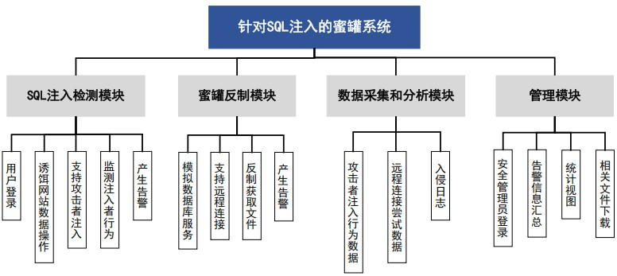
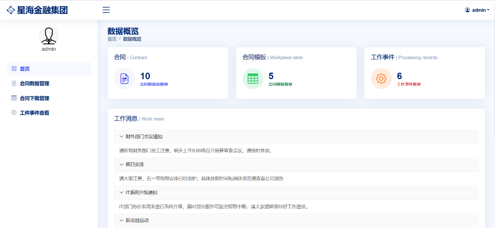
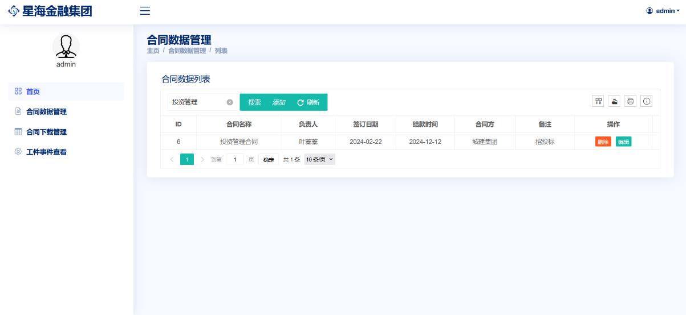
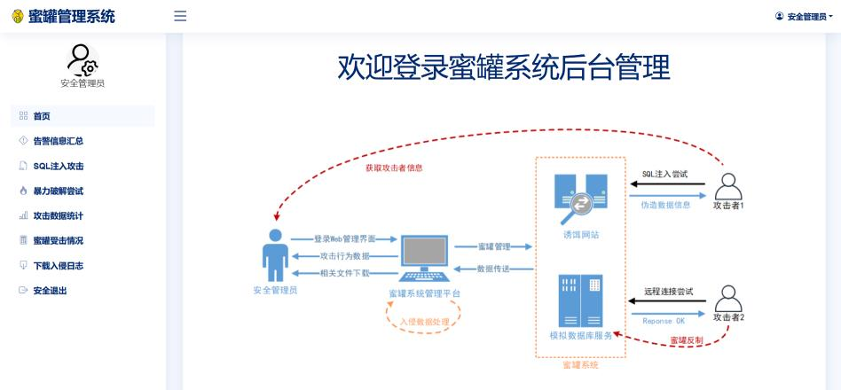
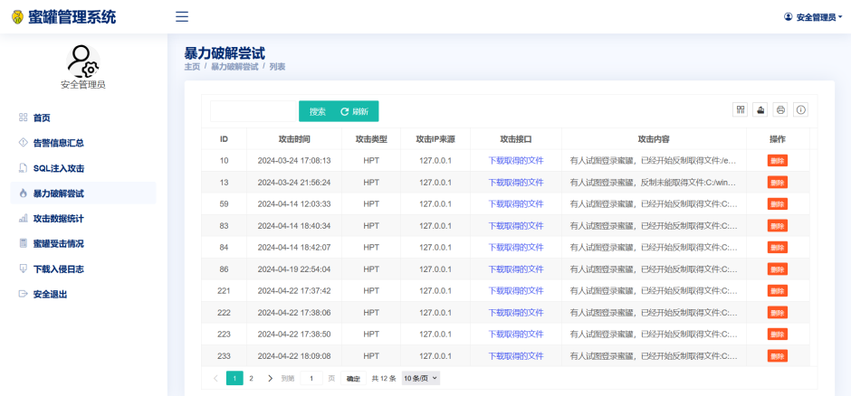
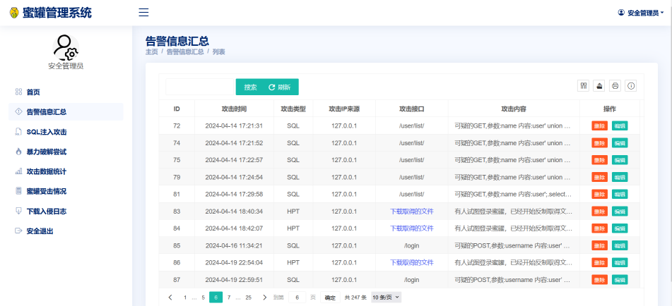

# 🛡️ SnareSQL: A Python-based Enterprise-Mimicking Honeypot

<p align="center">
  
  
  
  
  
  
  
  
</p>

> A lightweight honeypot platform that mimics a business web application, captures suspicious SQL injection attempts, and provides backend analysis for security research and demonstrations.

<p align="center">
  
</p>

## Overview

This project combines a Flask-based web application, SQLite storage, a standalone honeypot listener, and an admin console for attack analysis. It is designed to attract malicious requests, record them, and present the collected data in a structured way.

The web side simulates a company portal with public pages, employee login, data overview screens, contract-related pages, and a management backend. Suspicious requests are intercepted before they reach sensitive routes, while the honeypot service listens on a separate port and records protocol-level interaction attempts.

## Features

- Fake business portal with login and data pages
- SQL injection pattern detection for GET and POST requests
- Persistent attack logging to SQLite and `run.log`
- Standalone honeypot listener on a separate port
- Admin dashboard for alerts, attack records, and visual analytics
- Support for request source, URL, time, and payload inspection
- Dual event categories for SQL injection activity and honeypot hits
- Time-series and source-distribution views for quick incident review
- File download and record management actions in the backend console

## Layered Models Diagram

<p align="center">
  
</p>

The application is split into three practical layers:

- `Presentation layer`: fake public site and login pages used to increase realism
- `Detection layer`: request inspection, session gating, and honeypot entry handling
- `Analysis layer`: SQLite-backed admin pages, charts, and log tables

## Project Structure

```text
honeypotsystem/
|-- main.py
|-- honeypot.py
|-- adm_view.py
|-- common/
|   |-- mysqllib.py
|   `-- utils.py
|-- templates/
|-- static/
|-- adm.db
|-- db.sqlite3
|-- dicc.txt
`-- run.log
```

`main.py` is the primary entry point. It starts the Flask app on port `8020` and launches the honeypot listener on port `8308` in parallel.

## Main Modules

### Decoy Web App

The front end imitates a corporate system and includes pages for login, data overview, contract management, and work item handling.

Key public/user routes include:

- `/front_index`
- `/login`
- `/index`
- `/user/list/`
- `/get_all_contract/`
- `/get_eventlist/`

These pages are intentionally business-like so that malicious probes are more likely to interact with the system naturally.

### Request Detection

Incoming requests are scanned for common SQL injection keywords and suspicious characters before reaching sensitive routes. The current rule set looks for patterns such as `or`, `and`, `select`, `drop`, `insert`, quotes, semicolons, and similar tokens.

When a request is marked suspicious, the system records:

- source IP
- requested URL
- request method
- parameter payload
- log timestamp

### Honeypot Listener

A separate listener simulates database-style interaction and records honeypot hits as `HPT` events. The listener reads target file names from `dicc.txt`, attempts to match client behavior, and stores successful hits in the logging database.

### Admin Console

The admin area provides:

- Alert summaries
- SQL injection event lists
- Honeypot hit records
- Source IP statistics
- Time-based trend charts
- Record deletion and download actions
- Filterable tables for event review

## Requirements

- Python 3.9+
- Windows development environment
- Modern web browser

The repository includes a pinned `requirements.txt` for direct installation.

## Getting Started

```bash
# 1. Clone the repository
git clone https://github.com/yourusername/honeypotsystem.git
cd honeypotsystem

# 2. Create a virtual environment
python -m venv .venv

# 3. Activate the virtual environment
# Windows:
.venv\Scripts\activate
# Linux/Mac:
# source .venv/bin/activate

# 4. Install dependencies
pip install -r requirements.txt

# 5. Run the application
python main.py
```

After startup, open the web interface in your browser and explore the public pages, then switch to the admin console for attack analytics.

## Runtime Behavior

- Web service: `http://127.0.0.1:8020`
- Honeypot listener: `0.0.0.0:8308`
- Attack traces: `run.log`
- Security logs: `adm.db`
- Business data: `db.sqlite3`

## Key Endpoints

- **Public Portal:** `http://127.0.0.1:8020/front_index`
- **User Login:** `http://127.0.0.1:8020/login`
- **Admin Console:** `http://127.0.0.1:8020/8ad9min0124`  
  *(Note: The default admin credentials are **admin / 123456**. You can override this in `admin.txt`.)*
## Data Storage

- `db.sqlite3` stores business data
- `adm.db` stores security logs
- `run.log` stores runtime and attack traces

The main log fields are:

- `put_time`
- `type`
- `ip`
- `url`
- `info`

## Logging Model

The security log database uses event types to separate different behaviors:

- `SQL` for suspicious SQL injection activity
- `HPT` for honeypot hits

This split keeps the dashboard simple while still making it easy to compare attack patterns and honeypot traffic.

## Configuration

The current codebase uses local database files and a local upload directory. Typical runtime paths include:

- `./static/uploads`
- `run.log`
- `adm.db`
- `db.sqlite3`

The admin login flow also supports a local `admin.txt` file for credential override.

## System Demonstration

### Outer-Layer Decoy Portal

<p align="center">
  
  &nbsp;&nbsp;
  
</p>

<p align="center">
  
  &nbsp;&nbsp;
  
</p>

### Internal Honeypot Management System

<p align="center">
  
  &nbsp;&nbsp;
  
</p>

<p align="center">
  
  &nbsp;&nbsp;
  
</p>

## Disclaimer

This honeypot system is developed for **educational and security research purposes only**. 
Deploying honeypots on production environments carries inherent risks. The author is not responsible for any damage, data loss, or legal issues caused by the use or misuse of this software. Please use it responsibly and isolate it continuously from your core intra-networks.

## License

This project is licensed under the MIT License.